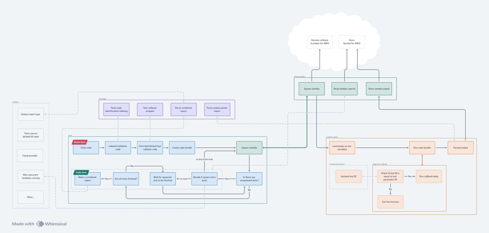

# Architecture

hypertest is built from several exchangeable components. Each component is responsible for a different layer of abstraction and can be replaced with another implementation of the same type. Components are configured in `hypertest.config.js` and orchestrated by the `@hypertest-cloud/core` package.

## Component types

hypertest uses three main component types:

| Component | Purpose | Example |
|-----------|---------|---------|
| **Test Runner Plugin** | Test framework integration | `@hypertest-cloud/plugin-playwright` |
| **Cloud Provider** | Cloud infrastructure management | `@hypertest-cloud/provider-cloud-aws` |
| **Runner** | Test execution in cloud functions | `@hypertest-cloud/runner-aws-playwright` |

### Test runner plugin

Responsible for all actions related to a particular test framework:

- Discovering test files in your project
- Preparing execution context for each test
- Building Docker images with your tests

See [Plugins](/plugins/overview) for details.

### Cloud provider

Handles interaction with cloud infrastructure:

- Authenticating with container registries
- Pulling and pushing Docker images
- Invoking cloud functions
- Updating function configurations

See [Clouds](/clouds/overview) for details.

### Runner

Executes tests inside cloud functions:

- Configuring the test framework for cloud execution
- Running individual tests based on invoke payload
- Collecting and uploading artifacts

See [Runners](/runners/overview) for details.

## System architecture

```
┌─────────────────────────────────────────────────────────────┐
│                     Your Machine                            │
│                                                             │
│  ┌─────────────────────────────────────────────────────┐   │
│  │                    core                             │   │
│  │         (orchestration & CLI)                       │   │
│  └───────────────────┬─────────────────────────────────┘   │
│                      │                                      │
│         ┌────────────┴────────────┐                        │
│         │                         │                        │
│         ▼                         ▼                        │
│  ┌─────────────────┐     ┌─────────────────┐              │
│  │  Test Runner    │     │ Cloud Provider  │              │
│  │    Plugin       │     │                 │              │
│  │  (Playwright)   │     │     (AWS)       │              │
│  └────────┬────────┘     └────────┬────────┘              │
│           │                       │                        │
└───────────┼───────────────────────┼────────────────────────┘
            │                       │
            │  Docker Image         │  Push/Invoke
            │                       │
            ▼                       ▼
┌─────────────────────────────────────────────────────────────┐
│                    Cloud Infrastructure                     │
│                                                             │
│  ┌──────────────┐  ┌──────────────┐  ┌──────────────┐      │
│  │     ECR      │  │    Lambda    │  │      S3      │      │
│  │  (images)    │  │  (functions) │  │  (artifacts) │      │
│  └──────────────┘  └───────┬──────┘  └──────────────┘      │
│                            │                                │
│                            ▼                                │
│                    ┌──────────────┐                        │
│                    │    Runner    │                        │
│                    │ (executes    │                        │
│                    │   tests)     │                        │
│                    └──────────────┘                        │
└─────────────────────────────────────────────────────────────┘
```

## Application flow

The core orchestrates two main processes: **deploy** and **invoke**.

### Deploy flow

The `hypertest deploy` command executes these steps:

1. **Load configuration** - Read and validate `hypertest.config.js`
2. **Pull base image** - Download pre-built image with test framework and dependencies
3. **Build target image** - Layer your tests on top of the base image
4. **Push to registry** - Upload the image to cloud container registry (ECR)
5. **Build manifest** - Record invoke payload contexts and test directory hash in cloud storage
6. **Update function** - Point the Lambda function to the new image

```
┌──────────┐    ┌──────────┐    ┌──────────┐    ┌──────────┐    ┌──────────┐
│  Pull    │───►│  Build   │───►│  Push    │───►│  Build   │───►│  Update  │
│  Base    │    │  Image   │    │  to ECR  │    │ Manifest │    │  Lambda  │
└──────────┘    └──────────┘    └──────────┘    └──────────┘    └──────────┘
```

### Invoke flow

The `hypertest invoke` command executes these steps:

1. **Generate run ID** - Create unique identifier for this test run
2. **Read manifest tests** - Plugin fetches previously stored manifest file where are stored all invocation payloads
3. **Invoke functions** - Cloud provider triggers Lambda functions concurrently
4. **Execute tests** - Runner executes tests and uploads artifacts to S3
5. **Collect results** - Aggregate results from all function invocations

```
┌──────────┐    ┌──────────┐    ┌──────────┐    ┌──────────┐
│ Generate │───►│ Read     │───►│  Invoke  │───►│ Collect  │
│  Run ID  │    │ Manifest │    │ Functions│    │ Results  │
└──────────┘    └──────────┘    └──────────┘    └──────────┘
                                      │
                                      ▼
                              ┌──────────────┐
                              │   Lambda 1   │──► S3
                              ├──────────────┤
                              │   Lambda 2   │──► S3
                              ├──────────────┤
                              │   Lambda N   │──► S3
                              └──────────────┘
```

## Package structure

hypertest is organized as a monorepo with these packages:

| Package | Description |
|---------|-------------|
| `core` | CLI and orchestration logic |
| `types` | Shared TypeScript interfaces |
| `plugin-playwright` | Playwright test framework integration |
| `provider-cloud-aws` | AWS Lambda, ECR, and S3 integration |
| `runner-aws-playwright` | Playwright execution in Lambda |

## Events system

`core` emits typed events throughout deploy and invoke so that the CLI, custom reporters, and tests can all react to the same stream without coupling to internal implementation.

The event bus is created by `createEventBus()` in `packages/core/src/events.ts` and passed through `setupHypertest({ events })`. The `HypertestEvents` interface exposes two methods:

```ts
interface HypertestEvents {
  emit(event: HypertestEvent): void;
  on(listener: (event: HypertestEvent) => void): () => void; // returns unsubscribe
}
```

### Event types

| Event | Emitted when |
|-------|-------------|
| `run:start` | Invoke begins; carries `runId`, `testCount`, `concurrency` |
| `run:end` | All tests complete; carries `result`, `localPath`, optional `artifactsBaseUrl` |
| `test:start` | A single test Lambda is invoked; carries `testId` |
| `test:end` | A single test completes; carries `testId` and `result` |
| `deploy:step` | A deploy step starts, ends, or errors; carries `step`, `status`, `durationMs`, `error` |
| `doctor:check` | A doctor check resolves; carries `title`, `status`, `message`, optional `data` |
| `doctor:done` | All doctor checks complete |

The full type definitions live in `packages/types/src/events.ts`.

## UI and reporters

`core` selects a reporter at startup based on the environment:

| Condition | Reporter | Output |
|-----------|----------|--------|
| stdout is a TTY **and** `--quiet` not passed | `inkReporter` | Rich terminal UI via [Ink](https://github.com/vadimdemedes/ink) |
| `--quiet` flag or non-TTY stdout | `plainReporter` | One line per event, suitable for CI logs |

Both reporters implement the same `Reporter` interface (`packages/core/src/ui/reporters/inkReporter.ts`):

```ts
interface Reporter {
  done: () => Promise<void>; // waits for UI to finish, then unmounts
  abort: () => void;         // signals early exit on error
}
```

`pickReporter` (`packages/core/src/ui/reporters/pickReporter.ts`) selects the correct reporter based on `process.stdout.isTTY` and the `--quiet` flag.

### Ink UI components

The TUI is built from composable Ink components under `packages/core/src/ui/`:

| Component | Purpose |
|-----------|---------|
| `apps/InvokeApp` | Full invoke view — static completed rows + live running list + summary |
| `apps/DeployApp` | Deploy view — step list with spinner, elapsed timer |
| `apps/DoctorApp` | Doctor view — check results with status icons |
| `apps/InitApp` | Post-init confirmation screen |
| `components/TestRow` | Single test row (running or done) |
| `components/StepList` | Deploy steps with status icons and durations |
| `components/InvokeSummary` | Run totals, failure details, and artifact/results paths |
| `components/DoctorCheck` | Single doctor check result |
| `components/StatusIcon` | Status glyphs (`✓` `✕` `◯` `○` `·` `▲`) and spinner |

Colors and icons are defined in `packages/core/src/ui/theme.ts`.

## Dev / demo mode

Set `HYPERTEST_DEV=true` to run the CLI against a local mock — no AWS credentials, Docker, or deployed infrastructure required. Useful for iterating on the Ink UI.

```bash
HYPERTEST_DEV=true npx hypertest invoke   # 14 mock tests with realistic durations
HYPERTEST_DEV=true npx hypertest deploy   # 5 animated deploy steps
HYPERTEST_DEV_SPEED=5                     # Speed multiplier (default 10×); lower = slower
```

The mock is implemented in `packages/core/src/dev/index.ts`. It emits the same events as the real core so the reporter layer is exercised identically.

## Logging

hypertest has two separate output streams. See [Logging](/developers/logging) for full details.

| Stream | Interface | Consumer |
|--------|-----------|---------|
| **Event bus** | `HypertestEvents` | Ink TUI and plain-text reporter |
| **Logger** | `config.logger` (Winston) | Configured Winston transports |

Events carry lifecycle signals (step started, test ended) that drive the UI. The logger carries operational and debug messages that bypass the UI and go directly to configured transports (stderr, file, remote sink, etc.). The logger is automatically silenced when the Ink TUI is active to prevent TTY rendering corruption.

## Extensibility

The plugin architecture allows adding support for:

- **New test frameworks** - Implement `TestRunnerPluginDefinition` interface
- **New cloud providers** - Implement `CloudProviderPluginDefinition` interface
- **New runners** - Create Lambda handler for your framework + cloud combination


