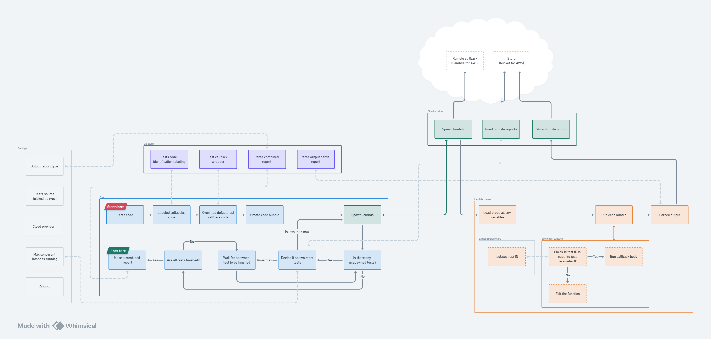

# Architecture

Hypertest project is build form several exchangeable segments. Each segment further called plugin or provider is responsible for different layer of app abstraction. Every plugin can be replaced with another of the same type. Plugins usage and their parameters can be configured in `hypertest.config`. Those puzzles are managed by `hypertest core` package which is responsible for processing application flow.

### Plugin types

- <strong>Test runner</strong> is responsible for all actions related to particular test library. It is preparing context for each test environment, and building an docker image for cloud function.
- <strong>Cloud function provider</strong> is delivering methods for interaction with cloud like pulling and pushing docker images, invoking cloud functions and updating its image.

### Application flow

Core is responsible for two processes. Deploying cloud function image in to the cloud infrastructure and running hypertest process. Before each step the setup is proceeded basing on `hypertest.config.js`. Config is validated and all the selected plugins are instantiated.

- Core deploy is counting four steps: pulling actual `base image` which is pre-prepared container image for particular setup (it accelerates deployment process). Then target image is builded from base image and user project. So all user tests are put in to cloud function image. Then this image is pushed in to the "container registry" depending on selected cloud infrastructure. Last step is setting this image as an image for hypertest cloud function (currently cloud function as an cloud asset has to be set by user but we aim in to IaC solution).

- Main hypertest process is acting in `invoke` method. First of all run id is generated, uniq for each hypertest process. Then test runner plugin is preparing function invoke payload, their purpose is to make possible running single test in a single cloud function invocation. Then cloud function invocations are made concurrently, process can simultaneously spawn as many tests as many is allowed by infrastructure setup. It is finished when each cloud function is ended.

- When cloud function is invoked the hypertest runner enters the game. Runner is prepared in advance container image (in deploy process) and placed in cloud function. Basing on invoke payload it is able to run single test. Then it saves test output in to the cloud bucket.

- <strong>(Coming soon)</strong> When main process is ended then the summary report is generated. It is based on artefact stored in the bucket.

