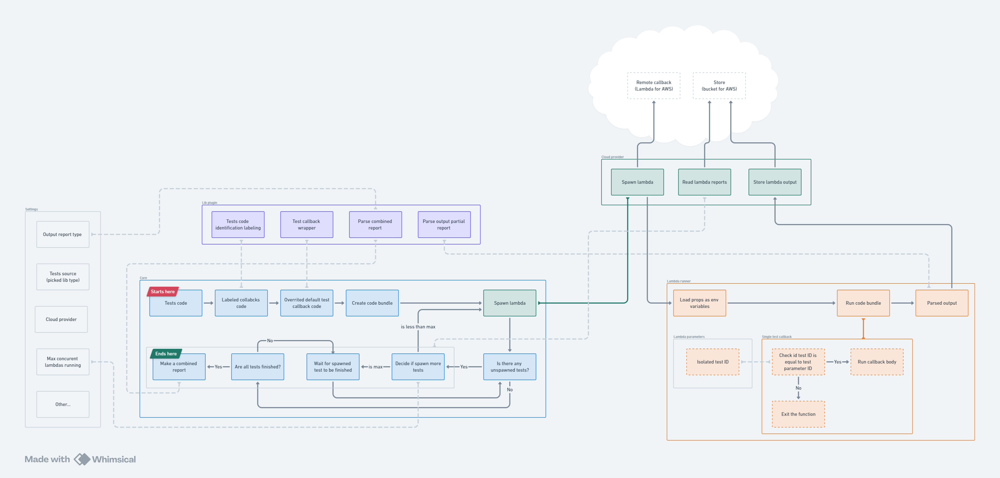

# Architecture

hypertest is built from several exchangeable components. Each component is responsible for a different layer of abstraction and can be replaced with another implementation of the same type. Components are configured in `hypertest.config.js` and orchestrated by the `@hypertest/hypertest-core` package.

## Component types

hypertest uses three main component types:

| Component | Purpose | Example |
|-----------|---------|---------|
| **Test Runner Plugin** | Test framework integration | `@hypertest/hypertest-plugin-playwright` |
| **Cloud Provider** | Cloud infrastructure management | `@hypertest/hypertest-provider-cloud-aws` |
| **Runner** | Test execution in cloud functions | `@hypertest/hypertest-runner-aws-playwright` |

### Test runner plugin

Responsible for all actions related to a particular test framework:

- Discovering test files in your project
- Preparing execution context for each test
- Building Docker images with your tests

See [Plugins](/plugins/overview) for details.

### Cloud provider

Handles interaction with cloud infrastructure:

- Authenticating with container registries
- Pulling and pushing Docker images
- Invoking cloud functions
- Updating function configurations

See [Clouds](/clouds/overview) for details.

### Runner

Executes tests inside cloud functions:

- Configuring the test framework for cloud execution
- Running individual tests based on invoke payload
- Collecting and uploading artifacts

See [Runners](/runners/overview) for details.

## System architecture

```
┌─────────────────────────────────────────────────────────────┐
│                     Your Machine                            │
│                                                             │
│  ┌─────────────────────────────────────────────────────┐   │
│  │               hypertest-core                        │   │
│  │         (orchestration & CLI)                       │   │
│  └───────────────────┬─────────────────────────────────┘   │
│                      │                                      │
│         ┌────────────┴────────────┐                        │
│         │                         │                        │
│         ▼                         ▼                        │
│  ┌─────────────────┐     ┌─────────────────┐              │
│  │  Test Runner    │     │ Cloud Provider  │              │
│  │    Plugin       │     │                 │              │
│  │  (Playwright)   │     │     (AWS)       │              │
│  └────────┬────────┘     └────────┬────────┘              │
│           │                       │                        │
└───────────┼───────────────────────┼────────────────────────┘
            │                       │
            │  Docker Image         │  Push/Invoke
            │                       │
            ▼                       ▼
┌─────────────────────────────────────────────────────────────┐
│                    Cloud Infrastructure                     │
│                                                             │
│  ┌──────────────┐  ┌──────────────┐  ┌──────────────┐      │
│  │     ECR      │  │    Lambda    │  │      S3      │      │
│  │  (images)    │  │  (functions) │  │  (artifacts) │      │
│  └──────────────┘  └───────┬──────┘  └──────────────┘      │
│                            │                                │
│                            ▼                                │
│                    ┌──────────────┐                        │
│                    │    Runner    │                        │
│                    │ (executes    │                        │
│                    │   tests)     │                        │
│                    └──────────────┘                        │
└─────────────────────────────────────────────────────────────┘
```

## Application flow

The core orchestrates two main processes: **deploy** and **invoke**.

### Deploy flow

The `hypertest deploy` command executes these steps:

1. **Load configuration** - Read and validate `hypertest.config.js`
2. **Pull base image** - Download pre-built image with test framework and dependencies
3. **Build target image** - Layer your tests on top of the base image
4. **Build manifest** - Snapshots currents state of tests existence in builded target image
5. **Push to registry** - Upload the image to cloud container registry (ECR)
6. **Update function** - Point the Lambda function to the new image

```
┌──────────┐    ┌──────────┐    ┌──────────┐    ┌──────────┐    ┌──────────┐
│  Pull    │───►│  Build   │───►| Build    │───►│  Push    │───►│  Update  │
│  Base    │    │  Image   │    | Manifest │    │  to ECR  │    │  Lambda  │
└──────────┘    └──────────┘    └──────────┘    └──────────┘    └──────────┘
```

### Invoke flow

The `hypertest invoke` command executes these steps:

1. **Generate run ID** - Create unique identifier for this test run
2. **Read manifest tests** - Plugin fetches previously stored manifest file where are stored all invocation payloads
3. **Invoke functions** - Cloud provider triggers Lambda functions concurrently
4. **Execute tests** - Runner executes tests and uploads artifacts to S3
5. **Collect results** - Aggregate results from all function invocations

```
┌──────────┐    ┌──────────┐    ┌──────────┐    ┌──────────┐
│ Generate │───►│ Read     │───►│  Invoke  │───►│ Collect  │
│  Run ID  │    │ Manifest │    │ Functions│    │ Results  │
└──────────┘    └──────────┘    └──────────┘    └──────────┘
                                      │
                                      ▼
                              ┌──────────────┐
                              │   Lambda 1   │──► S3
                              ├──────────────┤
                              │   Lambda 2   │──► S3
                              ├──────────────┤
                              │   Lambda N   │──► S3
                              └──────────────┘
```

## Package structure

hypertest is organized as a monorepo with these packages:

| Package | Description |
|---------|-------------|
| `hypertest-core` | CLI and orchestration logic |
| `hypertest-types` | Shared TypeScript interfaces |
| `hypertest-plugin-playwright` | Playwright test framework integration |
| `hypertest-provider-cloud-aws` | AWS Lambda, ECR, and S3 integration |
| `hypertest-runner-aws-playwright` | Playwright execution in Lambda |
| `hypertest-playwright-container` | Dockerfile for Playwright Lambda images |

## Extensibility

The plugin architecture allows adding support for:

- **New test frameworks** - Implement `TestRunnerPluginDefinition` interface
- **New cloud providers** - Implement `CloudFunctionProviderPluginDefinition` interface
- **New runners** - Create Lambda handler for your framework + cloud combination


